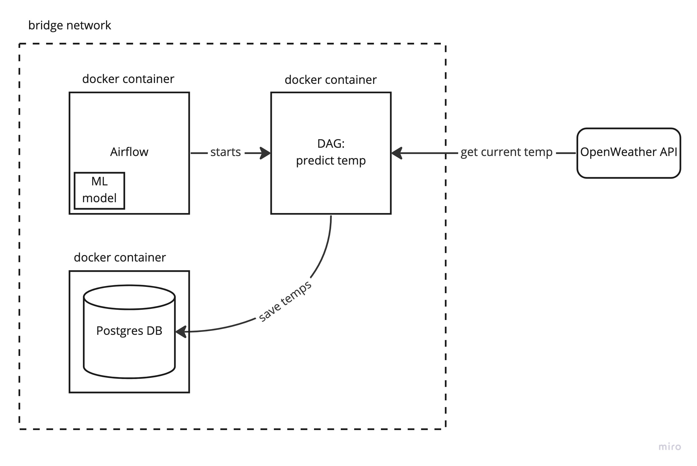

# Introduction
## Goal
The goal of this assignment is to test whether you are able to design and implement a data processing application. Data engineering at Sensorfact encapsulates three core challenges:

* **Data access**: collecting, storing and exposing data for the data team and the rest of the organization, e.g. collecting weather data regularly and storing it in a database
* **Data transformation**: building (streaming) data processing applications, e.g. to preprocess energy measurement data to be used in various downstream applications
* **Data products**: designing and developing (machine learning) code into robust and scalable applications, e.g. creating algorithm microservices or deploying a machine state detection model to production

All three topics come into this assignment to varying degrees. Please choose **one option** to implement, and keep in mind the following:
* We intend for you to spend only a few hours on this assignment, which is too little to do everything you might want. Decide what you want to focus on and reserve some time to wrap it up and communicate how far you got.
* Take this assignment as an opportunity to show us your style: what you like to work on, what you find important.
* If you have any further questions, do not hesitate to contact us.

## Deliverables
We will evaluate the results based on the following criteria:
* How flexible is your solution to (functional) changes?
* How clean, to the point, pragmatic is your code?
* Appropriate usage of state of the art big data tooling
* To what extend is your application scalable and fault-tolerant?
* Can you walk us through your choices and approach?

Before the date of the assignment interview, we ask you to send us a zipfile or repository with:
* A high level design diagram for the solution you created, showing data flows and types of tooling used
* Source code of your application

During the assignment interview, we ask that you walk us through some presentation slides where you describe the use case, outline your approach and weight the pros and cons of your choices. No need to send this beforehand.

# The assignment
## Context
Sensorfact's customers operate from highly diverse contexts. For certain machinery, weather conditions have a crucial impact on energy consumption. This is why we need to collect localized weather data on a structural basis. This is a fictional assignment, and not directly reflective of a real use case.

We ask you to build an application that processes data from a weather API on a structural basis. The API we use is OpenWeatherMap (https://openweathermap.org/api/one-call-api). An API key is provided in this assignment, it is free tiered and rate-limited at **60 calls per minute**.

## Option 1. Processing stream of precipitation forecasts
The `minutely` field in the API gives an hour ahead of precipitation volume forecasts (in mm) at the minute granularity. We ask you to build a streaming application that parses the 'minutely' response field and sums the forecasted precipitation volumes (in mm) for the next hour. The application should tell us in real time how much rain will fall in the coming hour at our office.

Use the following call to create the stream updates:
```Python
requests.get('https://api.openweathermap.org/data/2.5/onecall?lat=52.084516&lon=5.115539&exclude=hourly,daily,current&units=metric&appid=ace49a766053c083b15a916b5fed71d9')
```

Timestamps are unix seconds convertable to e.g. `pandas.Timestamp` through `pd.to_datetime(dt, unit='s', utc=True).tz_convert('CET')`. It's up to you if you want to keep the timestamps timezone-aware, but certain tools you use may depend on this information.

### Criteria for implementation:
* You will have to 'simulate' the data being generated in streaming fashion by making a new call every minute. For this you can use e.g. a simple cron job or some other preferred approach.
* For queuing the messages you should use a message queue tool that is scalable for big data loads
* For processing the stream of minute forecasts you should us a stream processing framework with a Python API, e.g. PySpark, Flink, Storm, Ksql
* For storing the processed stream, you can use any structured database or key-value store
* You will not get bonus points for a fancy UI, just being able to show the summed volume as a single number (for each lat-lon coordinate pair) in real time is enough
* The application can run on your local machine e.g. with docker-compose to run the tools you need, but if you prefer to use a cloud solution you are free to do so
* Make sure you design the application such that it has the right foundation to potentially scale to tens of thousands of coordinate pairs!
* **Bonus points**
    * If you can already include e.g. 50 more coordinate pairs (60 would be the rate limit)

## Option 2. Deploying a temperature forecast
We ask you to create a production-worthy hourly batch job that predicts the temperature for the next hour. To that end, we've already created a model trained on hourly historical data. The free tier returns max 5 days of history, hence this is the extent of the training set that was used. Description of the data science code:

    ├── temperature_forecast (scripts only needed for assignment option 2)
    │   ├── train.py        <- Script that can be used to retrain the model on the last ~5 days of API data
    │   ├── predict.py      <- Script that makes a prediction using the latest 24 hours of API data
    │   ├── utils.py        <- Helper functions & API parameters
    │   └── pipeline.pkl    <- Stored model pickle to be used for predictions

### Criteria for implementation
The solution should:
* Use a proper scheduling tool for running your batch job (Airflow, Prefect, Oozie, cloud solution, etc.),
* Show us that you are proficient in working with Docker for running services locally and/or for containerizing job code. For example:
    * For Airflow, use docker-compose to set up the necessary services (which communicate with each other). Bonus = run the DAG tasks themselves as Docker containers.
    * For Prefect, run a local Prefect server and run the job using a Docker agent in combination with DockerRun run config.
* Run the logic from `predict.py` and store the result in a database (a single prediction each time)
* Also store the real temperature values (which will be available an hour later)
* Include a unit test for the prediction method
* Extensions (the more implemented, the better):
    * A separate training pipeline that retrains the model daily
    * Simple dashboard that tracks accuracy

# Architecture



# How to run

Add a valid API key to `/dags/Dockerfile`. Then run `make airflow` to build the airflow containers, the Postgres database for the weather data
and the Docker image used in the DAG. Trigger the DAG manually in the UI or add a schedule in `predict_dag.py`. 